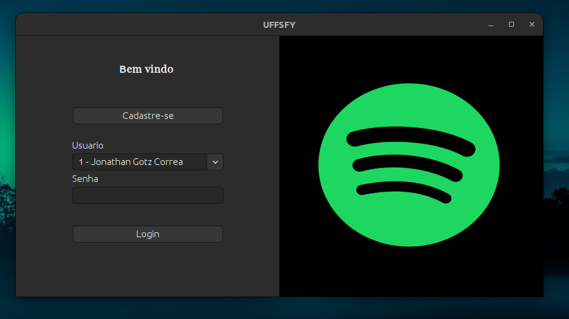
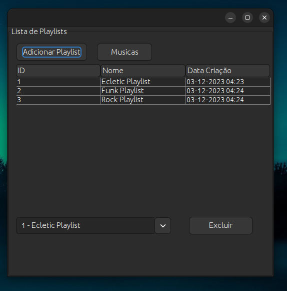
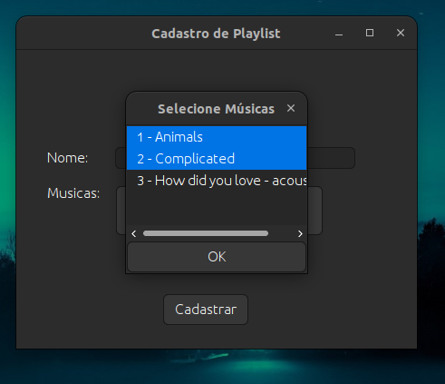

 

  

<h1 align="center" style="text-align: center;">UFFSFY</h1>

	
	
	
	
	

	<b>One way to create and manage your musics!</b> 
	Created with Java using Hibernate, Maven, H2Database, SpringBoot and Swing. 
	Made with ❤️ and tears.

 

	
  

 

	<b>Made to be a college project for the purpose of learning Java with framework!</b> 
	The idea was to create a CRUD system with free choice of theme, my choice was to kinda recreate Spotify 😁. 
	There's a lot here that I would love to improve actually, maybe one day i will commit.

